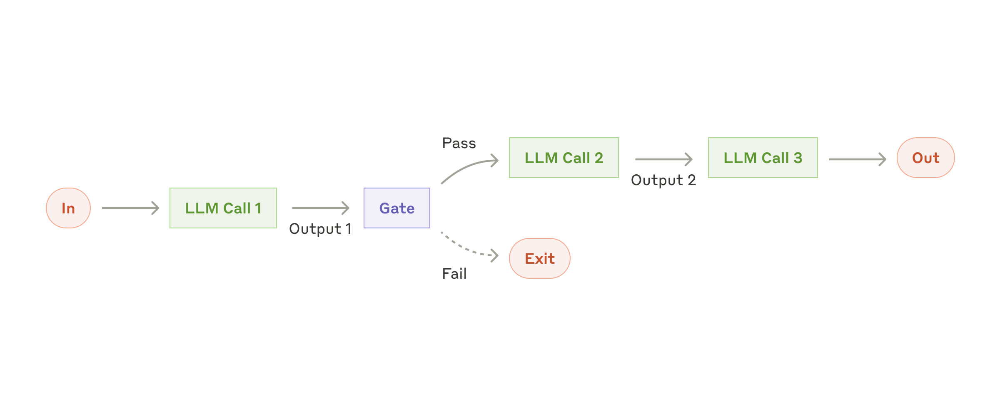
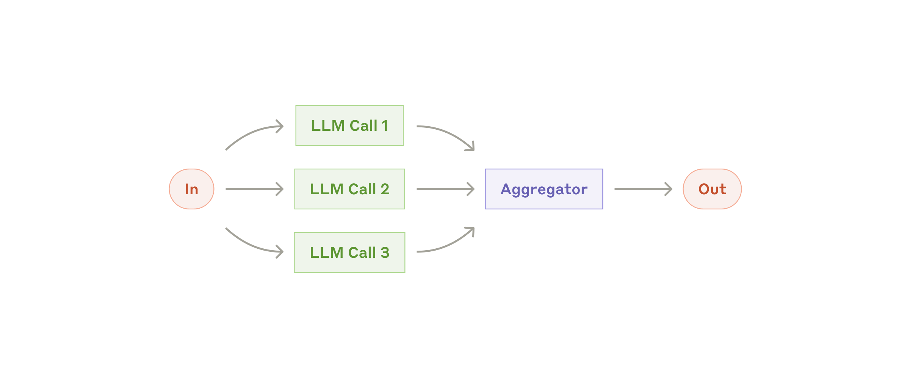
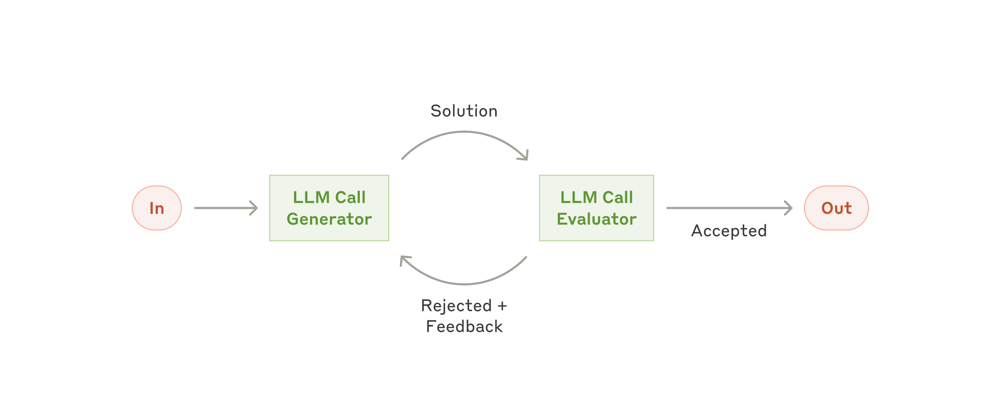
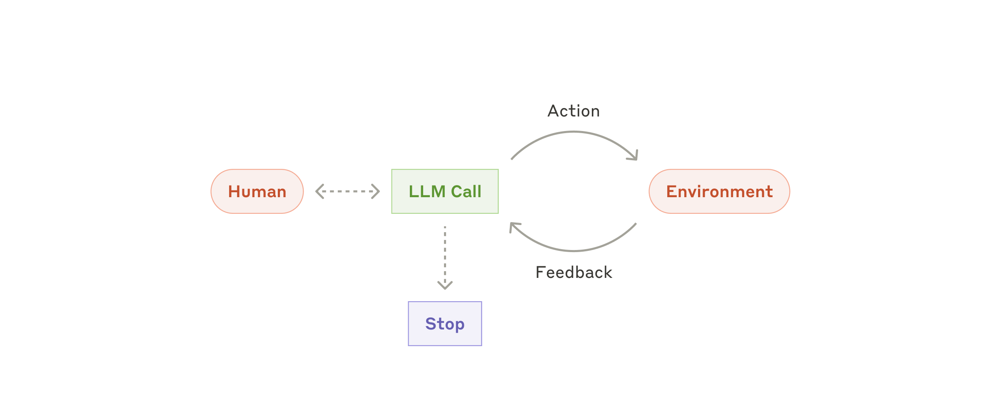

# Building Effective Agents with OpenAI

This repository recreates the workflows and agent patterns from Anthropic's
["Building effective agents"](https://www.anthropic.com/engineering/building-effective-agents)
article using the OpenAI Responses API.

The goal is educational: each example is intentionally small, direct, and easy
to inspect so you can see how the underlying pattern works without a large
framework in the way.

## What's in the repo

- `utils.py` centralizes OpenAI client setup, `.env` loading, and the shared
  `call_llm(...)` helper.
- `chaining.py` shows prompt chaining with a simple gate between steps.
- `routing.py` uses structured output to route a request to a specialized
  generator.
- `parallel.py` runs multiple LLM calls concurrently and aggregates the result.
- `orchestrator-workers.py` demonstrates a planner that breaks work into
  sections, then parallel workers that write each section.
- `evaluator-optimizer.py` loops between generation and evaluation until the
  output meets the target quality.
- `agent.py` is a basic tool-using agent with `add`, `multiply`, and `divide`
  functions exposed to the model.

## How the patterns map to the article

- Prompt chaining: `chaining.py`
- Routing: `routing.py`
- Parallelization: `parallel.py`
- Orchestrator-workers: `orchestrator-workers.py`
- Evaluator-optimizer: `evaluator-optimizer.py`
- Agent: `agent.py`

The implementations follow the article's core advice: keep systems simple,
prefer explicit workflows before introducing autonomy, and use structured
outputs or tools only when they add clear value.

## Workflow diagrams

The images below are copied into `docs/` from Anthropic's article so the repo
is self-contained and the README can point at local assets.

### Prompt chaining



Implementation: [chaining.py](./chaining.py)

### Routing


Implementation: [routing.py](./routing.py)

### Parallelization



Implementation: [parallel.py](./parallel.py)

### Orchestrator-workers


Implementation: [orchestrator-workers.py](./orchestrator-workers.py)

### Evaluator-optimizer



Implementation: [evaluator-optimizer.py](./evaluator-optimizer.py)

### Agent



Implementation: [agent.py](./agent.py)

## Requirements

- Python 3.11+
- An OpenAI API key set in `OPENAI_API_KEY`

## Setup

```bash
cp .env.example .env
# edit .env and replace the placeholder with your real OpenAI API key
uv sync
```

If you prefer not to use `uv`, install the dependencies from `pyproject.toml`
with your package manager of choice.

## Run the examples

Each file can be executed directly:

```bash
uv run python chaining.py
uv run python routing.py
uv run python parallel.py
uv run python orchestrator-workers.py
uv run python evaluator-optimizer.py
uv run python agent.py
```

## Implementation notes

- The shared helper in `utils.py` uses `client.responses.parse(...)`, which is
  why the examples can cleanly switch between plain text, structured output,
  and tool use.
- Several examples use Pydantic models to make the model's output shape
  explicit and easy to validate.
- The default model is configured in `utils.py`, so you can change it in one
  place if you want to experiment with different models.

## Why this repo exists

Anthropic's article emphasizes that effective agentic systems usually start as
simple workflows built from a few reliable primitives. This repo is a small
OpenAI-based reference implementation of those primitives so you can study,
modify, and extend them quickly.
